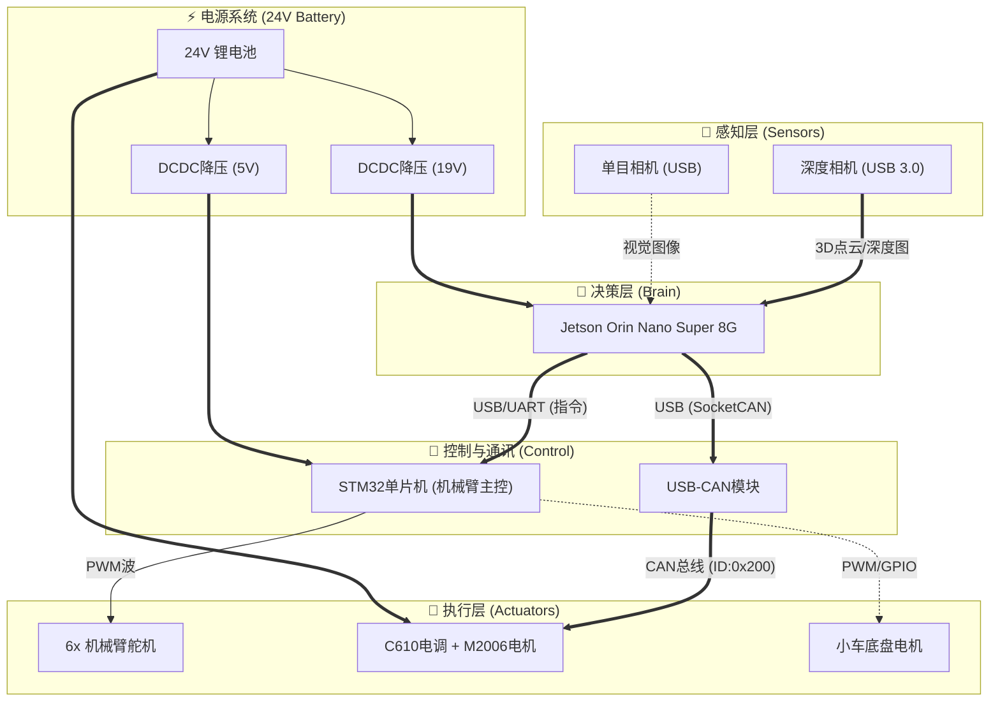

# 我的机器人架构图

```mermaid
graph TD
    %% 定义电源部分
    subgraph PowerSystem ["⚡ 电源系统 (24V Battery)"]
        Battery["24V 锂电池"]
        DCDC_19V["DCDC降压 (19V)"]
        DCDC_5V["DCDC降压 (5V)"]
    end

    %% 定义感知部分
    subgraph Sensors ["👀 感知层 (Sensors)"]
        CamMono["单目相机 (USB)"]
        CamDepth["深度相机 (USB 3.0)"]
    end

    %% 定义大脑
    subgraph Brain ["🧠 决策层 (Brain)"]
        Jetson["Jetson Orin Nano Super 8G"]
    end

    %% 定义通讯与控制
    subgraph Control ["📡 控制与通讯 (Control)"]
        STM32["STM32单片机 (机械臂主控)"]
        USBCAN["USB-CAN模块"]
    end

    %% 定义执行器
    subgraph Actuators ["🦾 执行层 (Actuators)"]
        ArmServos["6x 机械臂舵机"]
        M2006["C610电调 + M2006电机"]
        CarMotor["小车底盘电机"]
    end

    %% --- 连线关系 ---

    %% 1. 电源连接
    Battery ==> M2006
    Battery --> DCDC_19V
    Battery --> DCDC_5V
    DCDC_19V ==> Jetson
    DCDC_5V ==> STM32

    %% 2. 感知输入
    CamMono -.->|"视觉图像"| Jetson
    CamDepth ==>|"3D点云/深度图"| Jetson

    %% 3. 大脑通讯
    Jetson ==>|"USB/UART (指令)"| STM32
    Jetson ==>|"USB (SocketCAN)"| USBCAN

    %% 4. 底层控制
    USBCAN ==>|"CAN总线 (ID:0x200)"| M2006
    STM32 -->|"PWM波"| ArmServos
    STM32 -.->|"PWM/GPIO"| CarMotor
```